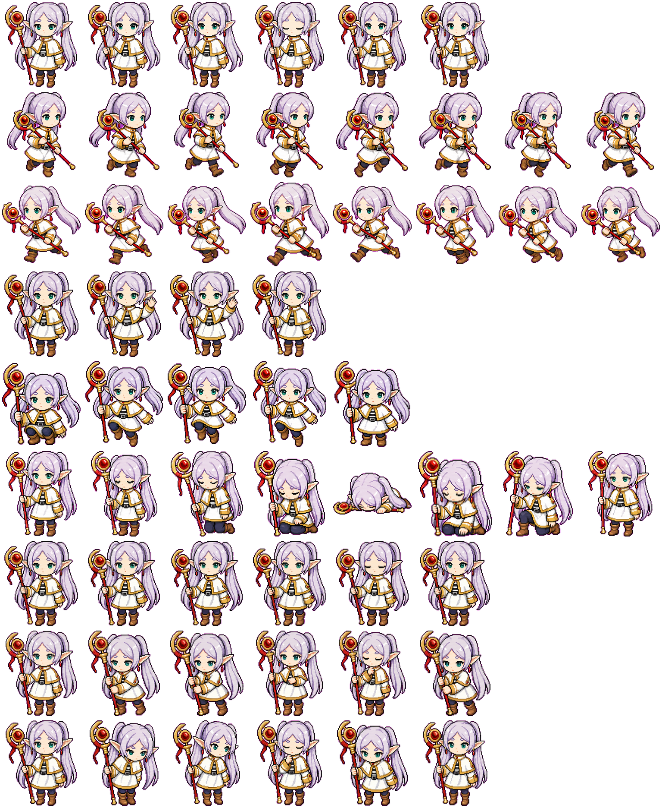

# Frieren Agent Monitor

A local, open-source macOS desktop companion for Claude Code, Codex, and Cursor.
Frieren floats above the desktop without a dashboard frame and keeps an eye on
agent sessions running locally or on remote machines reached through SSH.

<p align="center">
  
</p>

## Behavior

- Sleeping: no active sessions
- Walking: one or more sessions are running
- Orange alert: a session needs input
- Jumping with a green halo: a session just finished
- Idle: a live agent process is open but is not waiting for user input
- Hover: reveal running, waiting, recently finished, and idle sessions
- Quiet time: say hi after two minutes without interaction or new session activity
- Click Frieren: play an interaction animation
- Drag Frieren: move her around the desktop
- Right-click Frieren: set up monitoring for a remote SSH machine
- Click an active session: focus its app or open its project
- Click a remote session: open an SSH connection in the system terminal

Waiting and completion events also appear briefly in a notification bubble.
Idle sessions use a gray indicator, appear at the bottom of the list, and do
not trigger a needs-input alert or count as active work.
Session data stays on the Mac and explicitly configured SSH hosts; Frieren does
not send it to an external service.

## Requirements

- macOS 13 or later
- Swift 5.9 or later (Xcode or the Xcode Command Line Tools)
- Remote monitoring: an SSH-reachable Linux or macOS machine with Python 3

## Build and run

Build and launch from the repository:

```bash
./build.sh
open -n "build/Frieren Monitor.app"
```

To improve state detection, install hooks for any supported agents already
configured on this Mac:

```bash
./scripts/install-hooks.sh
```

Alternatively, build the app, install it in `~/Applications`, configure the
hooks, and launch it in one step:

```bash
./install.sh
```

Frieren discovers Claude Code and Cursor from local process and session data,
and Codex from top-level rollout logs. Internal Codex subagent turns are folded
into their parent task, while Cursor lifecycle hooks remain authoritative across
restarts of its persistent Agents Window host. Cursor rows use a short version
of the latest submitted prompt as their session summary. The hook installer
copies its event script to `~/.frieren-monitor/hook.sh` and adds entries alongside
existing hooks in:

- `~/.claude/settings.json`
- `~/.codex/hooks.json`
- `~/.cursor/hooks.json`

Only configuration directories that already exist are updated. Restart active
agent sessions after installing hooks.

## Remote machines over SSH

Remote monitoring uses the system OpenSSH client, including aliases, proxy
jumps, keys, and other options from `~/.ssh/config`.

1. Verify that `ssh <target>` works using a key or `ssh-agent`.
2. Right-click Frieren and choose **Set Up Remote SSH…**.
3. Enter the SSH target or config alias, an optional display name, and an
   optional identity file.
4. Click **Set Up**.

Frieren copies a small read-only collector to `~/.frieren-monitor` on the remote
machine, adds lifecycle hooks alongside existing agent settings, and registers
the host on the Mac. If the identity is already set by `~/.ssh/config`, leave
the identity-file field blank.

SSH must already work with a key or `ssh-agent`; interactive password prompts
are not supported. New host keys are accepted on first connection, while
changed host keys are rejected.

For command-line setup, run:

```bash
./scripts/install-remote.sh dev-vm "Development VM"
```

The first argument is an SSH target or `~/.ssh/config` alias. The optional
second argument is the name shown by Frieren. The installer adds the host to
`~/.frieren-monitor/hosts.json`. It preserves existing agent hooks.

Hosts can also be configured manually:

```json
{
  "hosts": [
    {
      "name": "Development VM",
      "sshTarget": "dev-vm",
      "identityFile": "~/.ssh/id_ed25519",
      "enabled": true
    }
  ]
}
```

Frieren polls enabled hosts concurrently every eight seconds with batch-mode
SSH and short connection timeouts. An unreachable host is shown as offline;
its last-known active sessions are retained instead of being reported as
finished. Remote Claude processes reported as idle are shown separately at the
bottom instead of being treated as needs-input sessions.

## License

[MIT](LICENSE)
